# FullStack -harjoitustyö
Tässä dokumentissa näytetään, miten lisätään palvelimelle lähetettäviä tietoja ja päivitetään sivun tietoja automaattisesti.

## Selaimelta annettavien tietojen vienti palvelimelle
### Frontend
Selaimella on nyt yksi syöttökenttä ja yksi painike.

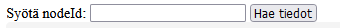

Lisätään toinen painike ja muutetaan tekstit

Lisätään toinen tapahtumakuuntellija

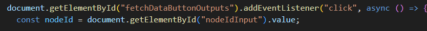

### Backend

Tehdään palvelimelle vasatavat temput

Ensin lähdöille oma käsittely

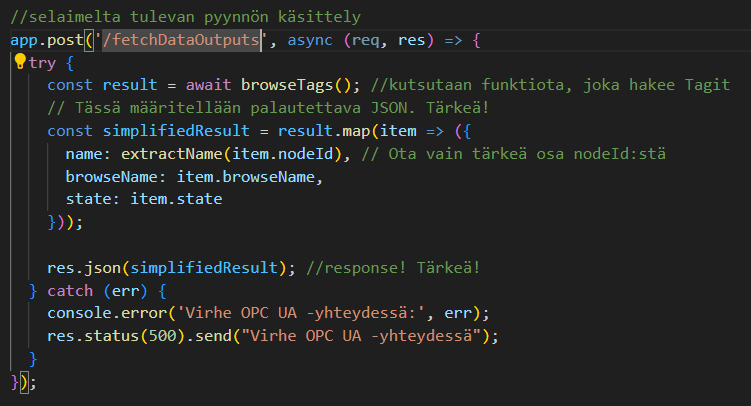

Muokataan browseTags-funtioita, jotta voidaan välittää selaimelta tulevat tiedot

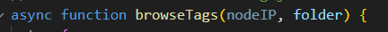

Muodostetaan oikeanmuotoinen string >>nodename>> 

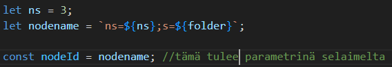

Tuodaan OPC UA -osoite. Vaatii bodyParserin.

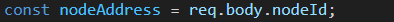

Nyt haku saa selaimelta tulevan osoitteen

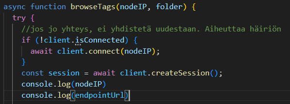

## Tilojen seuranta

Haluttujen tagien tiloja halutaan seurata, joten niille tiloille pitää muodostaa funktio, joka hakee niiden tiedot sekunnin välein.

Muokataan ensin niin, että jos tila on True, silloin tausta menee vihreäksi.

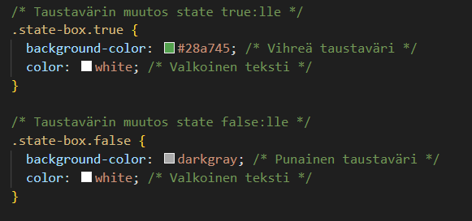

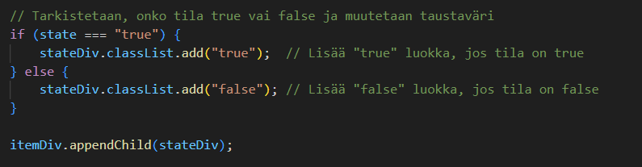

Jolloin selaimessa True-tilat erottaa helposti

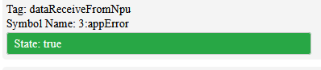

Aloitetaan pollaus, kun tilat on haettu ensimmäisen kerran

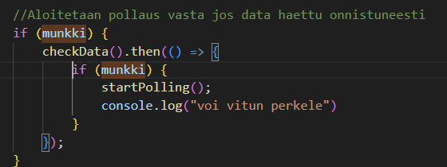

Tiedot haetaan samalla tavalla kuin painikkeella

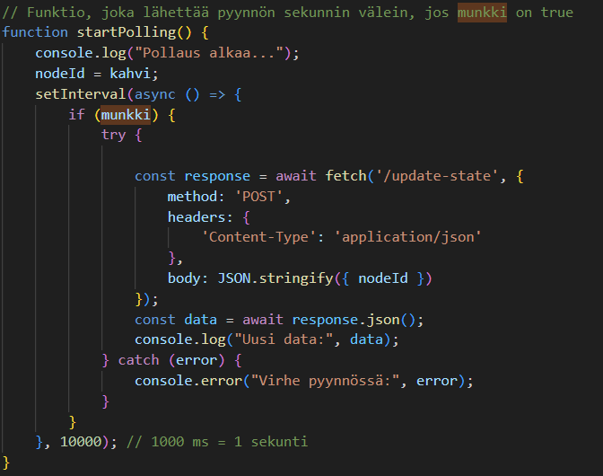

Serverin puolella on tallessa address ja kansio, mistä haetaan

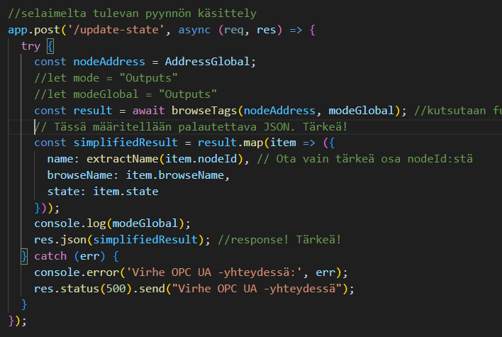

Varmaan voisi helpomminkin tehdä...