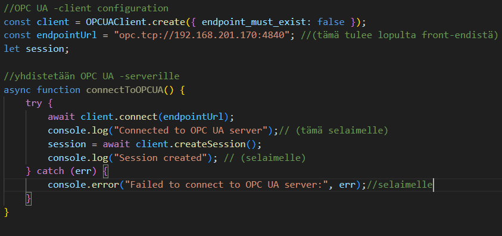

# Diagram

## Asennus
Aloitetaan tekeminen palvelimen päästä, asennetaan node.js (jos ei vielä asennettu)

Mennään kansioon, johon halutaan node.js pyörimään

> npm init -y

Asennetaan express (node.js toimii "sulavammin ja helpommin", CRUD!!)

> npm install express

## Ohjelma

Tuodaan modulit ja määritellään asetuksia...

Configuroidaan OPC UA -client ja muodostetaan yhteys palvelimelle

