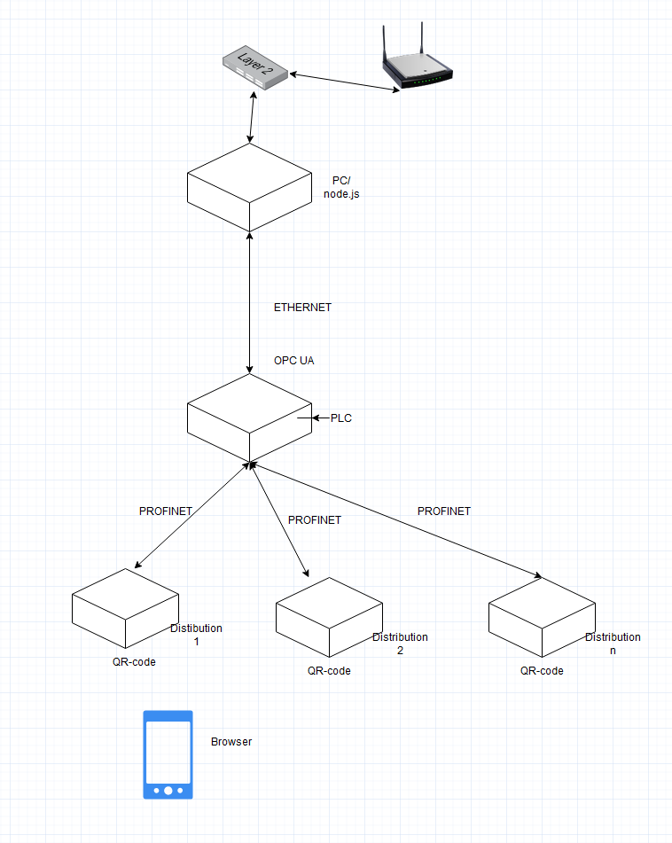
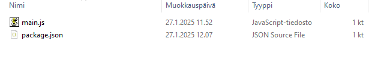
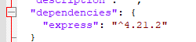
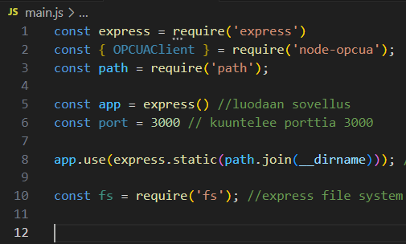
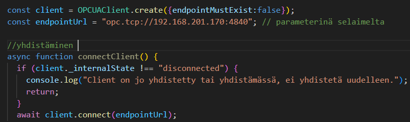
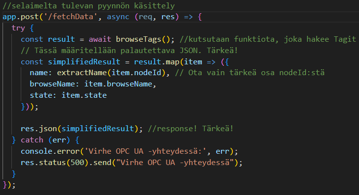
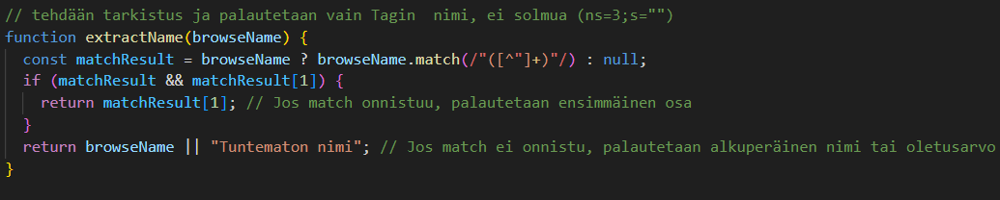
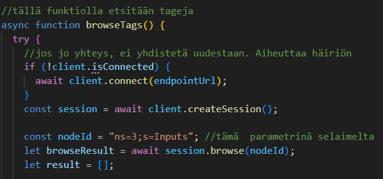

# FullStack -harjoitustyö

Tässä dokumentissa toimintaa selittävä kaavio, asennuksia ja ohjelmaa siihen asti, kun selaimelle tulostetaan ohjelmassa annetusta kansioista kaikki tagit, niiden nimet ja tilat. Tässä vaiheessa selaimelta annettavat parametrit eivät toimi eikä tageilla ei ole tapahtumakuuntelijoita. Ohjelman commit gitissä "Perustoiminnot OK"
## Diagram

## Asennus
Aloitetaan tekeminen palvelimen päästä, asennetaan node.js (jos ei vielä asennettu)

Mennään kansioon, johon halutaan node.js pyörimään

> npm init -y

Asennetaan express (node.js toimii "sulavammin ja helpommin", CRUD!!)

> npm install express

## Ohjelma

Tuodaan modulit ja määritellään asetuksia...

Configuroidaan OPC UA -client ja muodostetaan yhteys palvelimelle

Käsitellään selaimelta tuleva pyyntö

Selaimelle lähetettävä teksti siivotaan ylimääräisistä

OPC UA -serveriltä haetaan tietoja browseTags- ja browseSubsequentLevel -funktioilla.

