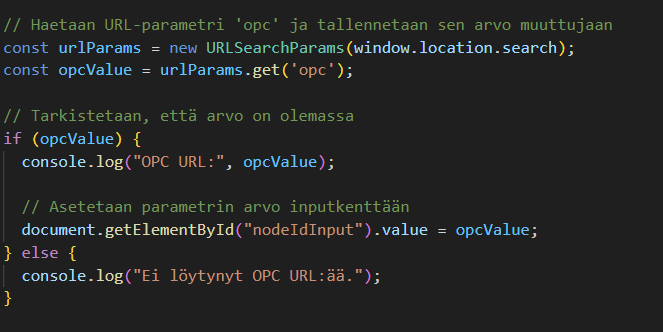
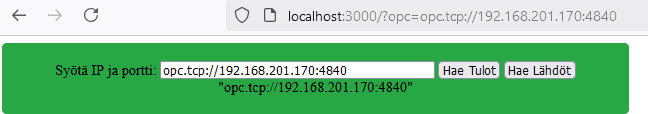
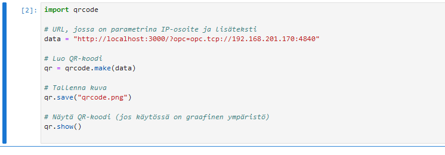

# FullStack-harjoitustyö

Tämä dokumentti sisältää sivun parametrin ottamisen käyttöön input-kenttään ja QR-koodin luomisen sekä sen mukaan ohjautumisen oikealle sivulle

## Sivun parametri 

Lisätään scripteihin seuraava koodi:

Input kenttä saa oikean arvon, kun osoite on seuraava
> http://localhost:3000/?opc=opc.tcp://192.168.201.170:4840

## QR-koodi

Luodaan pythonilla QR-koodi

QR-koodi

