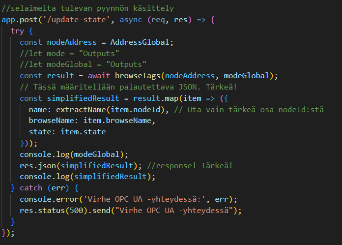
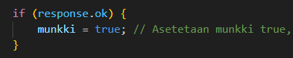
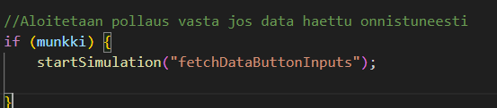
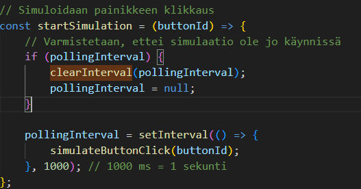
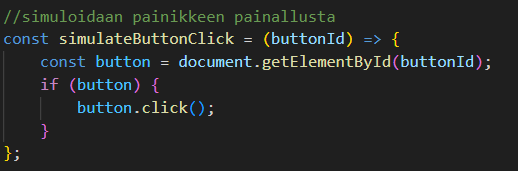

# FullStack-harjoitustyö

Tässä dokumentissa esitellään haettujen datojen päivitys. Tämän toimintaan saaminen vei aikaa kaikkein eniten, kokeilin SSE:tä ja etsin myös muita vaihtoehtoja. Tämä tuntuu vähän "purkkapaikalta", mutta toimii.

## Backend

browseTags-funktio saa parametreiksi nodeAddress:in ja modeGlabalin. Molempien muistipaikkojen tiedot on päivitetty silloin, kun selaimessa on painettu joko "Hae tulot"- tai "Hae lähdöt" -painiketta. Funktio palauttaa vain halutut osat selaimelle.

## Frontend

Kun tiedot on haettu onnistuneesti, asetetaan muuttuja "munkki" = 1

Voidaan aloittaa pollaus. Funktio startSimulation saa parametrinä joko fetchDataButtonInputs tai fetchDataButtonOutputs sen mukaan, kumpaa painiketta on painettu edellisen kerran

startSimulationilla simuloidaan painikkeen painamista sekunnin intervallilla. buttonID-muuttujassa on siis nyt joko fetchDataButtonInputs tai fetchDataButtonOutputs. Tämä siis välitetään funktiolle simulateButtonClick. HUOMAA: clearInterval tarvitaan, ettei setInterval -oliota luoda loputtomasti. 

simulateButtonClick nyt simuloi sekunnin välein painallusta ja tiedot päivittyvät oikein selaimelle.

